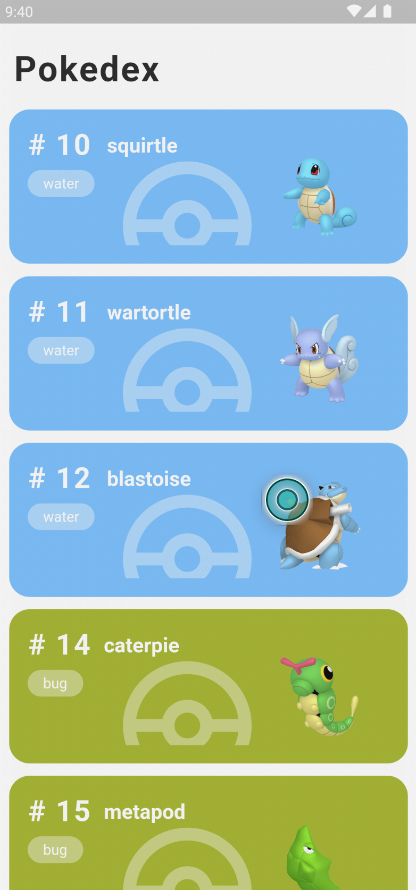

<h1 align="center">
  
</h1>

<p align="center">
  <a href="#page_with_curl-about">About</a>&nbsp;&nbsp;&nbsp;|&nbsp;&nbsp;&nbsp;
  <a href="#hammer-technologies">Technologies</a>
  &nbsp;&nbsp;&nbsp;|&nbsp;&nbsp;&nbsp;
  <a href="#books-requirements">Requirements</a>&nbsp;&nbsp;&nbsp;|&nbsp;&nbsp;&nbsp;
  <a href="#rocket-getting-started">Getting started</a>&nbsp;&nbsp;&nbsp;|&nbsp;&nbsp;&nbsp;
</p>

## :page_with_curl: About
This repository contains Pokedex app.

The Pokedex is an app which the user can view a list of Pokemons, search and view the details of a specific Pokemon. To get the Pokemons data it was used the [PokéAPI](https://pokeapi.co/).

## :hammer: Technologies

This project was developed with the following technologie:

- [Flutter3.3.10](https://docs.flutter.dev/development/tools/sdk/releases?tab=macos)

## :books: Requirements
- To have [**Git**](https://git-scm.com/) installed to clone the repository.
- To have [**Flutter3.3.10**](https://docs.flutter.dev/development/tools/sdk/releases?tab=macos) installed.
- An iOS or Android device or emulator.

## :rocket: Getting started
``` bash
  # Clone the repository:
  $ https://github.com/G3rson98/pokedex_app

  # Enter directory:
  $ cd pokedex_app
  
  # Install dependencies:
  $ flutter pub get
```

## :iphone: Running mobile
```bash
  # Run app:
  $ Flutter run
```


![](docs/2.png